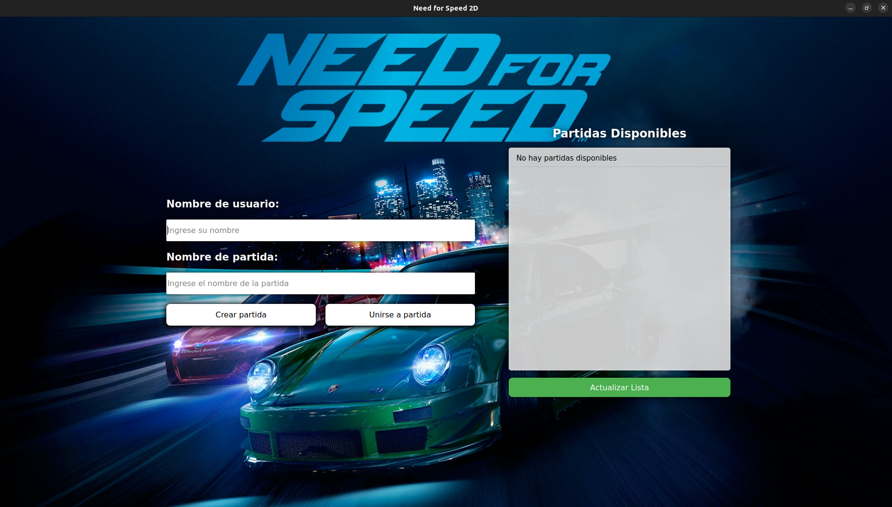
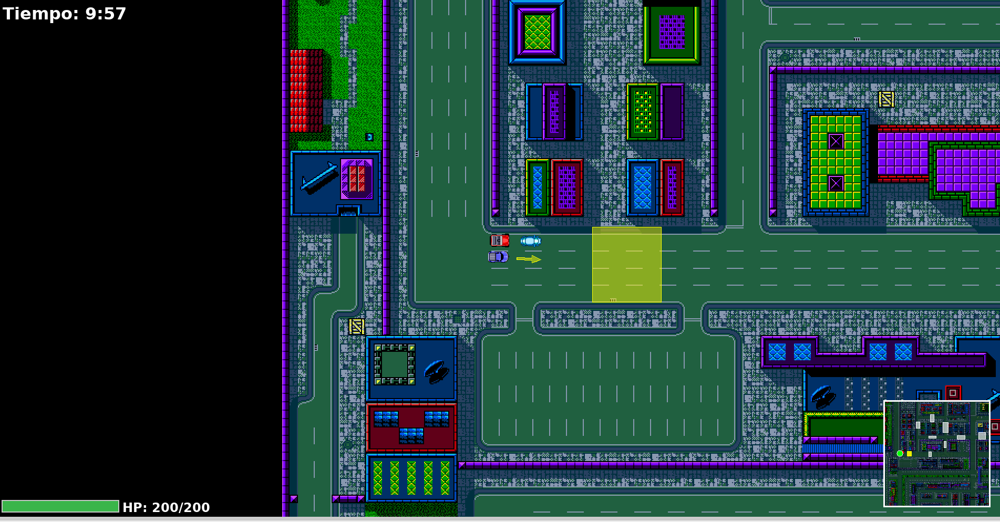
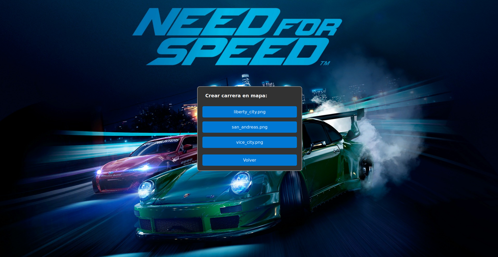
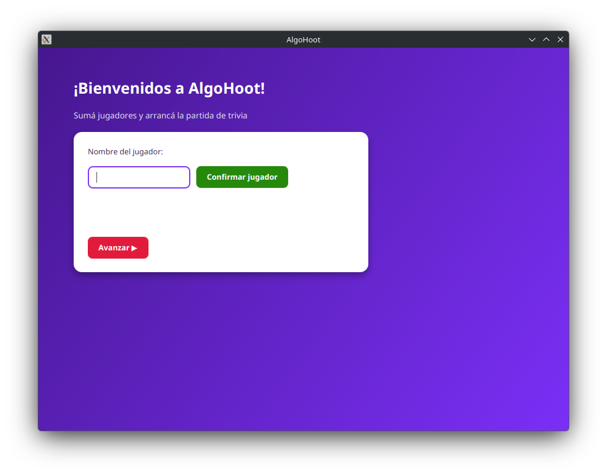
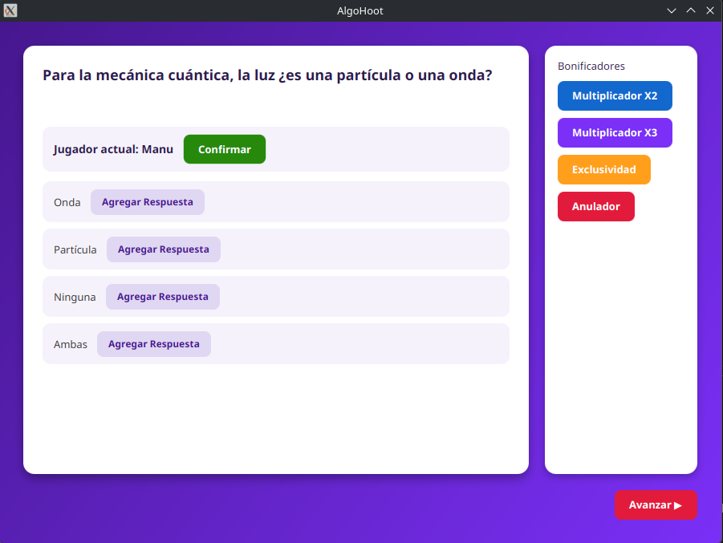
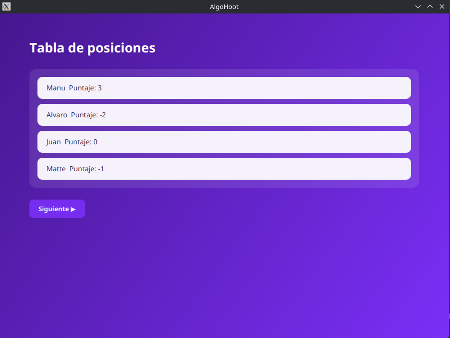

# ¡Hola! Soy Manuel Pueyrredón 👋

Estudiante de 4to año de Ingeniería Informática en la **Universidad de Buenos Aires (UBA)**, Argentina, con interés en desarrollo backend, ingeniería de software y machine learning aplicado. Este repositorio reúne los proyectos que más me representan como parte de mi portfolio: desde un juego multijugador cliente-servidor hasta un sistema distribuido en Rust y pipelines de Machine Learning.

### Intereses
- Backend & Software Development
- Problem Solving y Systems Design
- Machine Learning / NLP

### Actualmente cursando
- Programación Concurrente
- Ingeniería de Software II
- Empresas de Base Tecnológica II
- Aprendizaje Automático

### Colaboración
Abierto a colaborar en proyectos de sistemas backend, APIs, arquitectura de software o machine learning.

---

## 🚀 Proyectos destacados

### 🏎️ [Need for Speed 2D](https://github.com/ManuPueyUba/NeedForSpeed_2D)
**Octubre 2025 · Trabajo grupal — Taller de Programación I, FIUBA**

Juego de carreras multijugador estilo *Need for Speed*, con arquitectura **cliente-servidor** completa: servidor autoritativo, protocolo de red propio, editor de mapas incluido y un manual de usuario documentado paso a paso. Desarrollado en equipo de 4 personas con revisión de código de cátedra.

| Lobby | En carrera | Editor de mapas |
|---|---|---|
|  |  |  |

**Qué aprendí:**
- Diseño de una arquitectura cliente-servidor en tiempo real, con sincronización de estado entre múltiples clientes.
- Trabajo en equipo con git en un proyecto grande (compilación en C++ con CMake, revisiones de código, integración continua).
- Construcción de un editor de mapas propio, separado del cliente del juego.
- Documentación técnica orientada a usuario final (manual con capturas paso a paso).

`C++` `Sockets` `CMake` `Arquitectura cliente-servidor`

---

### 🎮 [AlgoHoot](https://github.com/ManuPueyUba/AlgoHoot)
**Septiembre 2024 · Trabajo grupal (versión personal rediseñada) — Algoritmos y Programación III, FIUBA**

Juego de trivia multijugador estilo *Kahoot* hecho en Java + JavaFX, con cuatro tipos de preguntas, bonificadores estratégicos y tabla de posiciones en vivo. Nació como TP grupal; esta versión es mi rediseño personal de portfolio: reescribí la interfaz (antes sin estilos) y la documentación.

| Inicio | Pregunta | Tabla de posiciones |
|---|---|---|
|  |  |  |

**Qué aprendí:**
- Patrones de diseño aplicados a un caso real: **Strategy** (tipos de pregunta/penalidad), **State** (bonificadores) y **Observer** (vista reactiva al modelo).
- Separación estricta MVC (Modelo / Vista / Controlador).
- Testing en profundidad: JUnit 5, Mockito y reglas de arquitectura automatizadas con **ArchUnit**.
- CI/CD con GitHub Actions + análisis estático de seguridad con **CodeQL**.
- Rediseño de una interfaz JavaFX desde cero, con foco en UX.

`Java` `JavaFX` `Maven` `JUnit 5` `Mockito` `ArchUnit` `Docker` `GitHub Actions` `CodeQL`

---

### 🎹 La Bandina — [Frontend](https://github.com/ManuPueyUba/La_Bandina) · [Backend](https://github.com/ManuPueyUba/La_Bandina_Backend)
**Agosto 2025 · Proyecto full-stack personal**

Simulador de piano web: frontend en Next.js/TypeScript y una API REST propia en FastAPI con autenticación, pensada para guardar composiciones y configuraciones de mapeo de teclas por usuario.

**Qué aprendí:**
- Desarrollo full-stack end-to-end: frontend en Next.js/TypeScript consumiendo una API propia.
- Autenticación basada en **JWT** y modelado de datos con **SQLAlchemy** + **Pydantic**.
- Dockerización completa del backend con `docker-compose` (API + PostgreSQL).
- Documentación automática de la API con Swagger.

`Next.js` `TypeScript` `FastAPI` `PostgreSQL` `SQLAlchemy` `JWT` `Docker`

---

### 🚲 Sistema distribuido de bicicletas compartidas (TP Concurrentes)
**Junio 2026 · Trabajo grupal (3 integrantes) — Programación Concurrente, FIUBA**

> ⚠️ Repo privado del curso (`concurrentes-fiuba/2026-1c-tp-toe`) — el link solo funciona si tenés acceso o lo hacen público.

Sistema descentralizado de alquiler de bicicletas estilo EcoBici, con tres tipos de procesos independientes en **Rust** (`client_app`, `station_node`, `payment_server`) que se comunican por sockets TCP con mensajes serializados en JSON. Las estaciones coordinan su estado mediante un líder elegido dinámicamente y soportan modo offline con reconciliación diferida de transacciones. ~4200 líneas de Rust repartidas en 4 crates.

**Qué aprendí:**
- Diseño de sistemas distribuidos reales: elección de líder con el **algoritmo Bully** y consenso de estado entre nodos.
- Transacciones consistentes entre procesos con **two-phase commit (2PC)**.
- Modelo de actores en Rust, con mensajes tipados entre `ClientApp`, `StationActor` y `PaymentServer`.
- Manejo de fallas de red: modo offline por estación, con cola de transacciones que se liquidan al recuperar conectividad.
- Diseño previo a codear: arquitectura y flujos documentados en diagramas antes de escribir una línea de Rust.
- Trabajo en equipo de 3 personas sobre un workspace de Cargo con múltiples crates.

`Rust` `Actor Model` `TCP Sockets` `Serde` `Bully Algorithm` `2PC` `Sistemas Distribuidos`

---

### 🐦 [ML Disaster Tweets — Clasificación NLP](https://github.com/ManuPueyUba/ml-disaster-tweets)
**Febrero 2026 · Competencia de Kaggle**

Proyecto de Machine Learning / NLP para clasificar si un tweet describe un desastre real o no, basado en la competencia [*Natural Language Processing with Disaster Tweets*](https://www.kaggle.com/competitions/nlp-getting-started) de Kaggle.

**Qué aprendí:**
- Preprocesamiento de texto y *feature engineering* aplicado a NLP.
- Comparación de distintos enfoques de modelado supervisado sobre el mismo dataset.
- Evaluación de modelos de clasificación con métricas estándar de competencias de ML.

`Python` `scikit-learn` `NLP` `Jupyter Notebook`

---

### 🛰️ [AlgoRastreador Z](https://github.com/ManuPueyUba/TP1-AlgoIII-AlgoRastreador)
**Julio 2024 · Algoritmos y Programación III, FIUBA**

Simulador del sistema "scouter" del universo Dragon Ball, escrito en **Smalltalk (Pharo)** como práctica de diseño orientado a objetos puro.

**Qué aprendí:**
- Programación orientada a objetos "pura" en Smalltalk/Pharo, sin estructuras de control tradicionales.
- Diseño basado en polimorfismo y manejo de excepciones en vez de condicionales.
- Validación de calidad de tests con **mutation testing**, no solo cobertura de código.

`Smalltalk` `Pharo` `POO` `Mutation Testing`

---

## 🎓 Otros proyectos y ejercicios

Prácticas, TPs universitarios y herramientas más chicas, agrupados para no perder de vista lo importante:

| Proyecto | Fecha | Stack | Aprendizaje clave |
|---|---|---|---|
| [Shell (Sistemas Operativos)](https://github.com/ManuPueyUba/Shell-Sisop) | Oct 2024 | C | Implementación de una shell tipo bash: pipes, redirección, jobs y variables de entorno a nivel de sistema. |
| [Prueba BackEnd FastAPI](https://github.com/ManuPueyUba/PruebaBackEndFastApi) | May 2025 | Python, FastAPI | Prácticas de autenticación (básica, JWT) y manejo de usuarios con distintos routers. |
| [Aprendizaje Automático — Apuntes](https://github.com/ManuPueyUba/Aprendizaje-Automatico) | Mar 2026 | mdBook, Rust | Apuntes teóricos de la materia, publicados como libro navegable con mdBook. |
| [TP2 Algoritmos y Programación II — "El Destino de James"](https://github.com/ManuPueyUba/111014_Pueyrredon_TP2) | Oct 2023 | C++ | Estructuras de datos y algoritmos aplicados a un caso de simulación, con tests propios. |
| [TP1 Algoritmos y Programación II — "El Inventario de James"](https://github.com/ManuPueyUba/111014_Pueyrredon_TP1) | Sep 2023 | C++ | Introducción a diseño modular en C++ con testing automatizado. |
| [Square Partition & Influencer Optimization](https://github.com/ManuPueyUba/SquarePartition-And-InfluencerOptimizationAlgorithm) | May 2024 | Python | Resolución de un problema de optimización combinatoria con **Branch and Bound**. |
| [Unruly.py](https://github.com/ManuPueyUba/unruly.py) | Abr 2023 | Python | Implementación del juego de lógica Unruly (Binario/Takuzu) con tests unitarios. |
| [create-issues](https://github.com/ManuPueyUba/create-issues) | Mar 2026 | Python | Script que parsea un README con épicas/historias y crea issues automáticamente en GitHub vía API. |

---

## 🚧 En progreso

Proyectos que arranqué y todavía no están terminados — los dejo listados por transparencia, no como algo para mostrar como "hecho":

| Proyecto | Fecha | Stack | Estado real |
|---|---|---|---|
| [TP Aprendizaje Automático — RAG sobre apuntes de FIUBA](https://github.com/ManuPueyUba/TP-AprendizajeAutomatico) | May 2026 | Python | Idea: pipeline RAG completo (scraping → chunking → embeddings → ChromaDB → LLM con citas). Por ahora **solo está hecho el scraper** que baja los repos/PDFs de FIUBA vía API; falta todo lo demás (extracción de texto, chunking, embeddings, vector DB y el endpoint de preguntas). |

---

## 🛠️ Stack general

---

📄 Mi CV completo está en [Resume_Manuel_Pueyrredon](https://github.com/ManuPueyUba/Resume_Manuel_Pueyrredon).

### Fun fact
Me gusta viajar, conocer gente nueva y esquiar.
